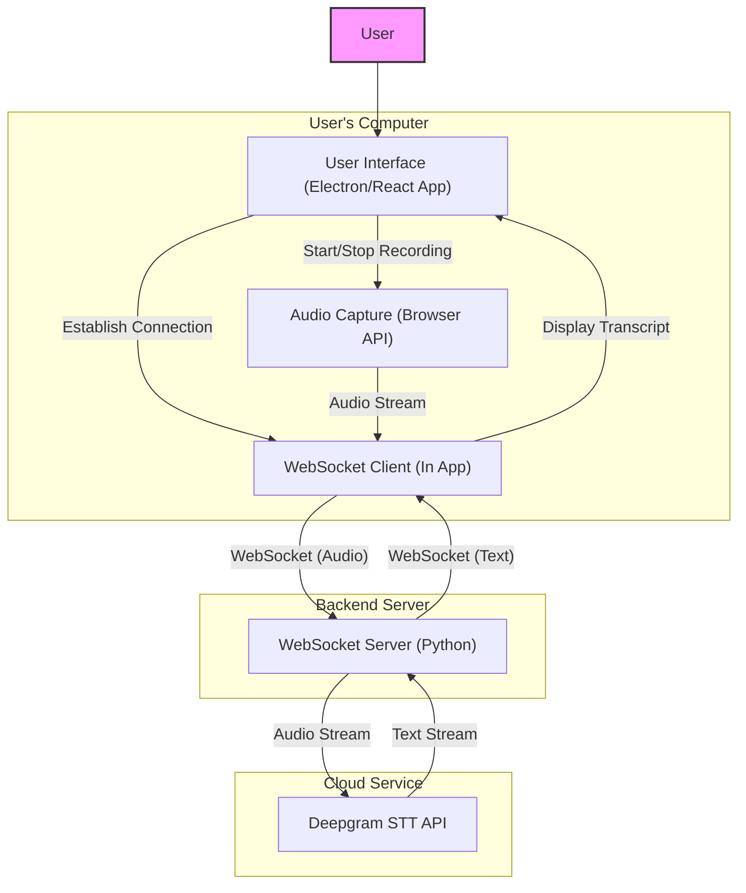
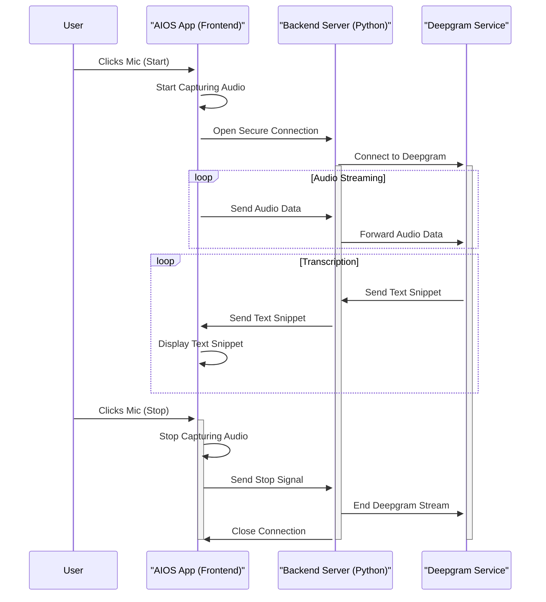

# Streaming Speech-to-Text (STT) Architecture: Electron + Backend

This document outlines the responsibilities for the frontend (Electron/React application) and the backend (Python WebSocket server) to implement real-time, streaming speech-to-text functionality using Deepgram.

## Frontend (Electron/React - `src/renderer/src/components/thread/index.tsx`)

The frontend is responsible for capturing user audio, managing the UI state, and communicating with the backend via WebSockets.

**1. UI Elements:**
    *   Implement a microphone button (`<Button>`) with icons (`Mic`, `MicOff`).
    *   The button's appearance should reflect the recording state (idle, recording, error).
    *   The button should be disabled when STT is unavailable or during message submission (`isLoading`).
    *   Display error messages received from the backend or generated locally (e.g., WebSocket connection failure).

**2. State Management:**
    *   `isRecording` (boolean): Tracks if audio capture and streaming to the backend are active.
    *   `sttError` (string | null): Stores error messages related to STT for display.
    *   `input` (string): The existing state for the text input, which will be populated by transcription results.
    *   Ref for WebSocket instance: To manage the connection lifecycle.

**3. Audio Capture:**
    *   Use `navigator.mediaDevices.getUserMedia({ audio: true })` to request microphone permissions.
    *   Use the `MediaRecorder` API to capture audio.
        *   Configure `MediaRecorder` with appropriate MIME type (e.g., `audio/webm;codecs=opus` or `audio/wav`) compatible with what the backend/Deepgram expects. **Note:** The Deepgram Python example used `linear16`, which typically implies raw PCM. The backend might need to handle potential transcoding if the browser can't directly provide `linear16`. Clarify expected format with the backend team.
    *   Capture audio in chunks using the `ondataavailable` event.

**4. WebSocket Communication:**
    *   **Connection:**
        *   Establish a WebSocket connection to the backend server endpoint (e.g., `wss://your-backend.com/stt-stream`) when the user initiates recording.
        *   Handle connection opening (`onopen`), closing (`onclose`), and errors (`onerror`). Update UI state accordingly (e.g., set `sttError`, `isRecording`).
    *   **Sending Messages:**
        *   On `onopen`, send a configuration message (if needed by the backend) specifying audio parameters like sample rate, encoding, channels (align with `MediaRecorder` output and Deepgram needs). Example: `{"action": "configure", "audio_format": {"encoding": "linear16", "sample_rate": 16000, "channels": 1}}` (Adjust based on backend requirements).
        *   On `mediaRecorder.ondataavailable`, send the audio chunk (`event.data` as Blob or ArrayBuffer) over the WebSocket. Use `ws.send(event.data)`. Ensure the backend knows how to handle binary frames.
        *   When the user stops recording, send an end-of-stream message. Example: `{"action": "stop"}`.
    *   **Receiving Messages:**
        *   Implement the `onmessage` handler to process messages from the backend.
        *   Expect JSON messages indicating transcription results. Example format (adapt as needed):
            *   `{"type": "interim_transcript", "transcript": "User speaking..."}`
            *   `{"type": "final_transcript", "transcript": "User has spoken."}`
            *   `{"type": "error", "message": "Deepgram error details..."}`
        *   Update the `input` state based on received `interim_transcript` and `final_transcript` messages.
        *   Update the `sttError` state based on received `error` messages.

**5. Lifecycle Management:**
    *   Initiate WebSocket connection and `MediaRecorder` when the user clicks the mic button (if not already recording).
    *   Stop `MediaRecorder` and send the "stop" message over WebSocket when the user clicks the mic button again (if recording).
    *   Ensure WebSocket connection is properly closed (`ws.close()`) when the component unmounts or recording is definitively finished.

## Backend (Python WebSocket Server)

The backend acts as a proxy between the Electron client and the Deepgram streaming API, handling WebSocket connections and Deepgram integration.

**1. WebSocket Server:**
    *   Implement a WebSocket server endpoint (e.g., `/stt-stream`) using a Python framework (e.g., FastAPI, `websockets`, AIOHTTP).
    *   Manage multiple concurrent client connections. Maintain state for each client (e.g., their Deepgram connection instance).

**2. Handling Client Messages:**
    *   **Connection:** On client connect, prepare to receive messages.
    *   **Configuration:** (Optional, based on design) Receive an initial message from the client specifying audio format details (`sample_rate`, `encoding`, `channels`). Use these to configure the Deepgram connection.
    *   **Audio Data:** Receive binary WebSocket frames containing audio chunks.
    *   **Control Messages:** Receive JSON messages like `{"action": "stop"}` to know when the client is finished sending audio for a session.

**3. Deepgram Integration:**
    *   Use the Deepgram Python SDK (`deepgram-sdk`).
    *   **Initialization:** When a client connects (or sends a specific "start" message), initialize a Deepgram streaming connection (`deepgram.listen.asyncwebsocket.v("1")`). Configure `LiveOptions` based on client configuration or defaults (e.g., `model`, `language`, `encoding`, `sample_rate`, `channels`, `interim_results`, `endpointing`, `vad_events`). **Ensure Deepgram's expected audio format matches what the client sends.**
    *   **Audio Forwarding:** Forward audio chunks received from the client's WebSocket directly to the corresponding Deepgram connection using `dg_connection.send(audio_chunk)`.
    *   **Event Handling:** Implement Deepgram event handlers (`on_message`, `on_utterance_end`, `on_metadata`, `on_error`, etc.) for each client's connection.
    *   **API Key:** Load and use the Deepgram API key securely from environment variables or a configuration system. **Do not expose it to the client.**

**4. Sending Messages to Client:**
    *   Inside Deepgram's `on_message` handler:
        *   If `result.is_final` is false, send an interim transcript message back to the *specific client* over *their* WebSocket. Example: `await client_websocket.send_json({"type": "interim_transcript", "transcript": result.channel.alternatives[0].transcript})`
        *   If `result.is_final` is true (and potentially `result.speech_final`), send a final transcript message. Accumulate final segments if needed before sending, as shown in the Deepgram example using `is_finals`. Example: `await client_websocket.send_json({"type": "final_transcript", "transcript": full_utterance})`
    *   Inside Deepgram's `on_error` handler, send an error message back to the client. Example: `await client_websocket.send_json({"type": "error", "message": str(deepgram_error)})`

**5. Lifecycle and Error Handling:**
    *   Gracefully handle client WebSocket disconnections: Ensure the associated Deepgram connection is closed (`await dg_connection.finish()`).
    *   Handle errors during Deepgram connection/streaming and inform the client via WebSocket message.
    *   Manage resources correctly for concurrent users.

## Architecture Diagram

This diagram shows the main components and how they interact.

## Sequence Diagram (Simplified)

This diagram shows the sequence of events when the user records audio.

This document should provide a clear separation of tasks and a visual guide for both teams to ensure smooth integration. Remember to agree on the exact JSON message formats and audio encoding details between the frontend and backend teams.